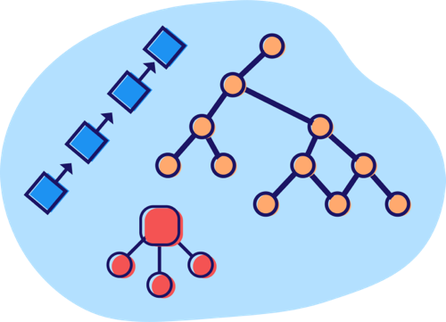
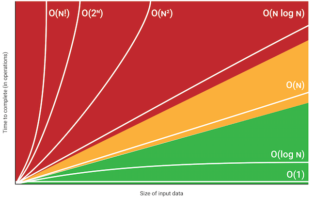
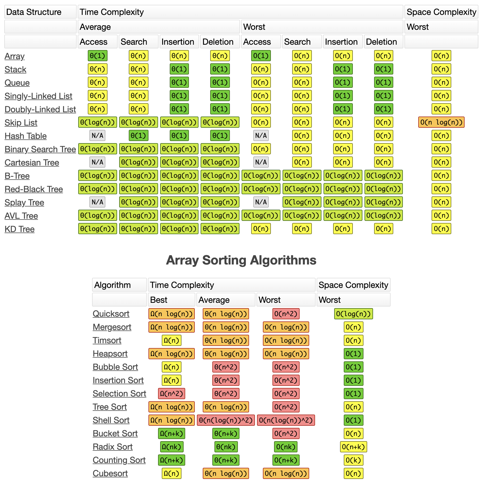
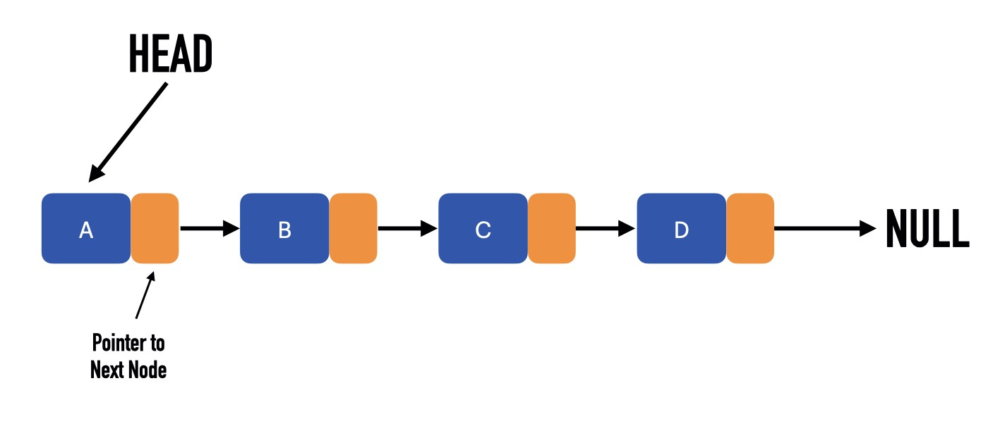
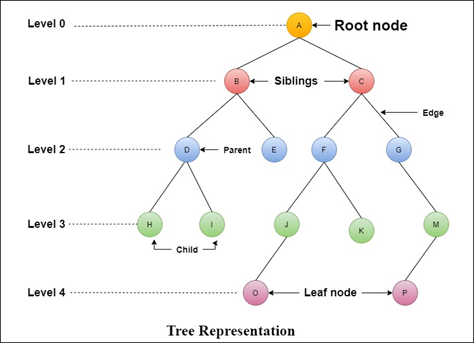

# Data Structures and Algorithms in Kotlin

Let's dive into **Time Complexity**, **Space Complexity**, **Big O Notation**, **Data Structures**, **Algorithms** in kotlin language. Knowing these can make any developer a better one.

## Time Complexity
Is a measure of the time required to run an algorithm as the input size increases.

## Space Complexity
Is a measure of the resource required for the algorithm to manipulate the input data.

## Big O Notation
Is used to represent the general form of time and space complexity.

**Time & Space Complexity** are high-level measure of scalability. They don't measure the actual speed of the algorithm itself.

For small data sets, **Time Complexity** is usually irrelevant.

As you can see in above picture we have some types of **Big O Notation**:
- **O(N!)** means **_Factorial Time_**
- **O(2^N)** means **_Exponential Time_**
- **O(N^2)** means **_Quadratic Time_**
- **O(N log N)** means **_Quasilinear Time_**
- **O(N)** means **_Linear Time_**
- **O(Log N)** means **_Logarithmic Time_**
- **O(1)** means **_Constant Time_**

The **Green** color represent that the algorithm speed is good when size of the data increasing

The **Red** color represent that the algorithm speed is ad when size of the data increasing

## Remember this chart in your decisions

## Data Structures
- LinkedList
- Array  
- Stack
- Queue
- Tree
- Binary Tree
- Binary Search Tree
- AVL Tree
- Trie
- Heap
- Priority Queue
- Hashtable
- Set
- Graph

## Algorithms
- Linear Search
- Binary Search
- Quicksort
- Mergesort
- Timsort
- Heapsort
- Bubbl sort
- Insertion sort
- Tree sort
- Selection sort
- Bucket sort
- Radix sort
- Counting sort
- Cubesort
- Shell sort

## LinkedList

A collection of values arranged in a linear, unidirectional sequence which has several advantages over contiguous storage
options such as Array & ArrayList:
- constant time insertion and removal from the front of the list
- reliable performance characteristics

LinkedList consists of Nodes and each node has two responsibility
- Hold a value
- Hold the reference to the next node, the **null** marks the end of the list.

Pros:
- LinkedList has O(1) time complexity for head first insertion but **Array & ArrayList** has O(n) time complexity
for it.
- Dynamic data structure
- No memory wastage

Cons:
- As soon as you move from one node to another, you can't go back cause there is only has reference to the next node.
- In LinkedList the elements aren't in contiguous blocks of memory. This could lead to more cache misses, which increase the access time.

## Tree

It's a data structure of profound importance. It's used to tackle many recurring challenges in software development. 

such as: 
 - Representing hierarchical relationships 
 - Managing sorted data
 - Facilitating fast lookup operations

Just like **LinkedList** the trees consists Node but the Node contains two child nodes.

The topmost node in the tree is called the **root** of the tree. this node is the only node that has no parent.

A node that has no child is called as **Leaf**.

## Sponsor
### If you like and use it, please tap the Star(⭐️) button at the above.
This source code is free for all; hence, it's not profitable. You can make me happy by donating me :)

## License

    Copyright 2021 Mehdi Janbarari

    Licensed under the Apache License, Version 2.0 (the "License");
    you may not use this file except in compliance with the License.
    You may obtain a copy of the License at

       http://www.apache.org/licenses/LICENSE-2.0

    Unless required by applicable law or agreed to in writing, software
    distributed under the License is distributed on an "AS IS" BASIS,
    WITHOUT WARRANTIES OR CONDITIONS OF ANY KIND, either express or implied.
    See the License for the specific language governing permissions and
    limitations under the License.
